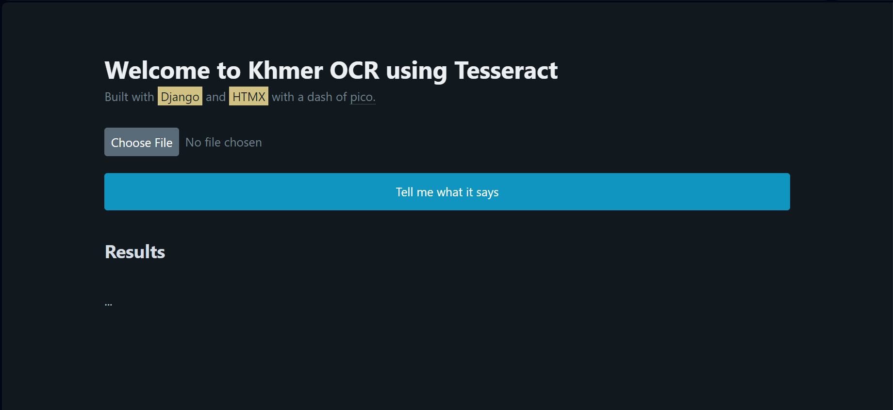

# Khmer OCR with Tesseract and Django

## About 
We decided to build a web interface for our past project of doing Khmer OCR with Tesseract from our previous semester.

This program automatically looks for **English** and **Khmer** letters in the image and give you the text.

- Year: 4, Semester: 2
- Subject: Python II
- Lecturer: Chen Sovann

### Team members
- Hou Neavireakpong
- Hong Rotha

## Setup
1. Install python
  https://www.python.org/downloads/  
2. Install django
  ```bash
  pip install django pytesseract pillow
  ```
3. Install tesseract
  For windows: https://github.com/UB-Mannheim/tesseract/wiki  
  *Please select the languages you would like to use OCR for when installing.*  

